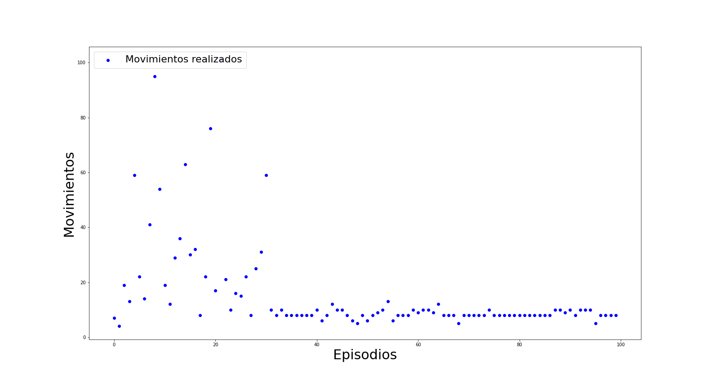
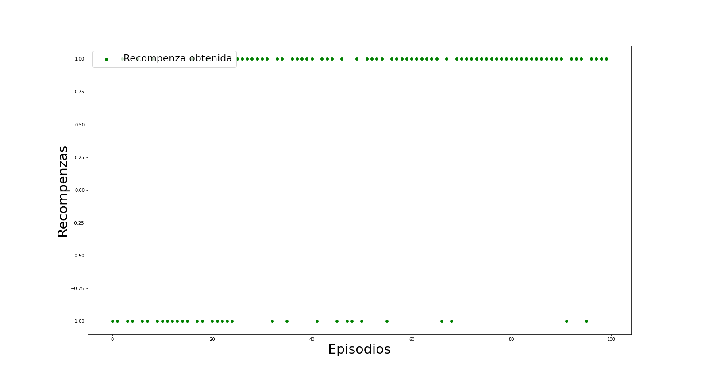

# Maze problem with Reinforcement Learning

The environment can be represented as:
* States: posiciones en el mapa [posiciones en el mapa]
* acciones: arriba, abajo, izquierda y derecha [0,1, 2, 3]
* recompenza: +1 si llegaste al oro, -1 si entraste en una zona negrita, 0 si te moviste solamente.

## Results
Después de los 50 episodios se puede ver la convergencia a encontrar el punto. 

  
  
