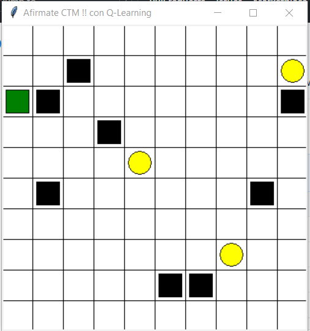
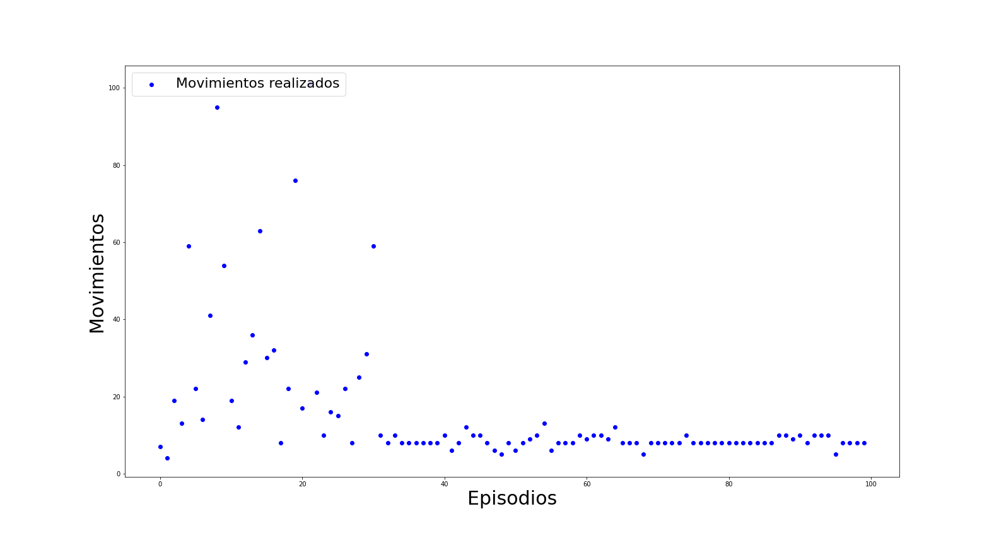
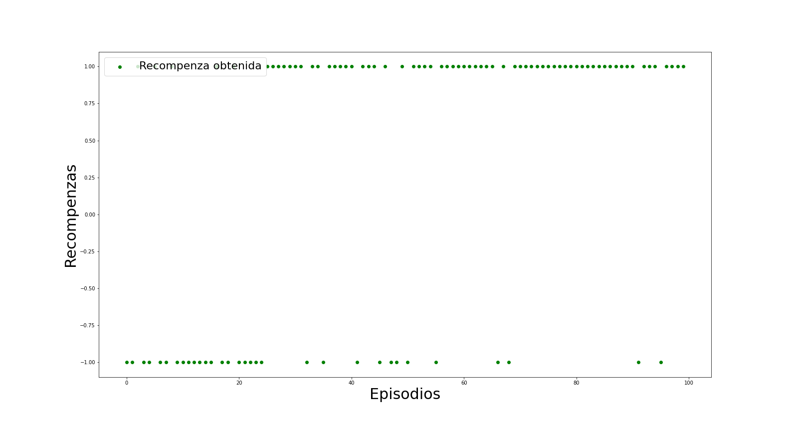

# Reinforcement Learning (buscador de oro)

[](https://travis-ci.org/joemccann/dillinger)



The environment can be represented as:
* estados: posiciones en el mapa [posiciones en el mapa]
* acciones: arriba, abajo, izquierda y derecha [0,1, 2, 3]
* recompenza: +1 si llegaste al oro, -1 si entraste en una zona negrita, 0 si te moviste solamente.

## Probar el agente por tu cuenta
```sh
$ git clone https://github.com/matheus695p/reinforcement-learning.git
$ cd reinforcement-learning
$ echo instalar los requirements
$ pip install -r requirements.txt
$ python app.py
```

## Resultados
Después de los 100 episodios se puede ver la convergencia en movimientos del agente, en donde encuentra las rutas más rápidas para llegar a los puntos de oro. 

  
  
